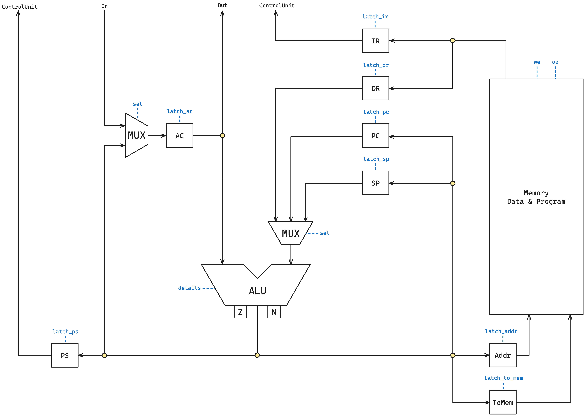

# Игрушечный процессор

## Детали выполненной работы

### Автор

 > Тучков Максим Русланович, P33121
 
### Вариант

 > asm | acc | neum | hw | instr | struct | trap | port | pstr | prob2 | spi
 >
 > Без усложнения

 ### Описание варианта

- **asm** -- синтаксис ассемблера. Необходима поддержка label-ов.
- **acc** -- система команд должна быть выстроена вокруг аккумулятора.
    - Инструкции -- изменяют значение, хранимое в аккумуляторе.
    - Ввод-вывод осуществляется через аккумулятор.
- **neum** -- фон Неймановская архитектура.
- **hw (hardwired)** -- ContolUnit реализуется как часть модели.
- **instr** -- процессор необходимо моделировать с точностью до каждой инструкции (наблюдается состояние после каждой инструкции).
- **struct** -- машинный код в виде высокоуровневой структуры данных. Считается, что одна инструкция укладывается в одно машинное слово.
- **trap** -- ввод-вывод осуществляется токенами через систему прерываний.
- **port (port-mapped)** -- (специальные инструкции для ввода-вывода).
    - адресация портов ввода-вывода должна присутствовать.
- **pstr (Length-prefixed / Pascal string)** -- перед строкой указывается её длина
- **prob2** -- Even Fibonacci numbers (сумма четных чисел Фибонначи, не превышающих 4 млн).
- **spi** -- ввод-вывод реализуется через интерфейс SPI (один канал на отправку и получение).
    - необходима визуализация передачи данных через SPI.


## Язык программирования

### Форма Бэкуса-Наура

```ebnf
<program> ::= <program_line> | <program_line> <end_of_line> <program>

<program_line> ::= <code_line> | <comment> | <code_line> <comment>

<code_line> ::= <data_definition> | <address_definition> | <label_definition> | <directive>

<address_definition> ::= "org" <non_neg_number>

<label_definition> ::= <label> ":"

<data_definition> ::= <label> ":" <end_of_line> <data>

<data> ::= ".word" <operand> | ".word" <non_neg_number> "," <string>

<operand> ::= <number> | <label>

<directive> ::= <onear_instruction> <address_link> | <branch_instruction> <address_link> | <nullar_instruction>

<address_link> = <label> | "(" <label> ")"

<label> ::= <word>

<string> ::= "'" <text> "'"

<comment> ::= ";" <text>

<text> ::= <word> | <word> <text>

<word> ::= <letter> | <letter> <word>

<number> ::= [-]<non_neg_number>

<non_neg_number> ::= <digit> | <digit> <non_neg_number>

<nullar_instruction> ::= "inc" | "dec" | "halt" | "ei" | "di" | "push" | "pop" | "iret"

<branch_instruction> ::= "jg" | "jz" | "jnz" | "jmp"

<onear_instruction> ::= "load" | "store" | "add" | "out" | "in" | "cmp" | "test"

<letter> ::= "a" | "b" | "c" | ... | "z" | "A" | "B" | "C" | ... | "Z" | <digit>

<end_of_line> ::= "\n" | "\r\n"

<digit> ::= "0" | "1" | "2" |  ... | "9"
```

### Краткое описание

Любая непустая строка -- это:

- Метка (`<label_definition>`)
    - Последовательность символов с двоеточием на конце
- Опеределение данных = Метка + Данные  (`<data_definition>`)
    - Данные требуют обязательного ключевого слова *.word*
- Определение адреса (`<address_definition>`)
    - Требует ключевого слова *org* с последующим указанием адреса
- Директива = инструкция + метка (`<directive>`)
    - Все инструкции с одним аргументом -- адресные
- Комментарий -- это любая последовательность символов после *;*

### Семантика

- Глобальная видимость данных
- Поддерживаются целочисленные литералы (без ограничений на размер)
- Поддерживаются строковые литералы в виде Length-prefixed
    - Пример объявления строковых данных: `.word 7, 'Penskoi'`
- Код выполняется последовательно
- Точка входа в программу -- метка `_start` (метка не может повторяться или отсутствовать)
- Название метки не должно:
    - совпадать с названием команды
    - начинаться с цифры
    - совпадать с ключевыми словами `org` или `.word`
- Метки располагаются на строке, предшествующей строке с командой, операнды находятся на одной строке с командами
- Пробельные символы в конце и в начале строки игнорируются
- Любой текст, расположенный в конце строки после символа `;` трактуется как комментарий

Память выделяется статически, при запуске модели.

## Организация памяти

```text
               Registers
+------------------------------------+
| AC - аккумулятор                   |
+------------------------------------+
| IR - регистр инструкции            |
+------------------------------------+
| DR - регистр данных                |
+------------------------------------+
| PC - счётчик команд                |
+------------------------------------+
| SP - указатель стека               |
+------------------------------------+
| Addr - адрес записи в память       |
+------------------------------------+
| ToMem - данные при записи в память |
+------------------------------------+
| PS - состояние программы           |
+------------------------------------+

            Instruction & Data memory
+-----------------------------------------------+
|    0    :  jmp _start                         |  <-- PC, SP
|    1    :  interruption vector address (iva)  |
|        ...                                    |
| _start  :  program start                      |
|        ...                                    |
|   iva   :  interruption handler               |
|        ...                                    |
+-----------------------------------------------+
```

- Память данных и команд общая (фон Нейман)
- Размер машинного слова не определен (достаточно, чтобы влезало число для `prob2`)
- Размер памяти не определен (определяется при симуляции)
- Адрес `0` зарезервирован для перехода к началу программы
- Адрес `1` зарезервирован для указания адреса подпрограммы обработки прерывания ввода
- Виды адресации:
    - абсолютная
    - косвенная
- Назначение регистров
    - AC -- главный регистр (аккумуляторная архитектура), содержит результаты всех операций, подключен к портам ввода-вывода
    - IR -- содержит текущую выполняемую инструкцию
    - DR -- содержит временные данные для выполнения операций
    - PC -- содержит адрес следующей инструкции, которая должна быть выполнена
    - SP -- при операциях push и pop уменьшается и увеличивается соответственно (стек растет снизу вверх)
    - Addr -- содержит адрес, по которому произойдет запись в память (при we)
    - ToMem -- содержит данные, которые должны быть записаны в память (при we)
    - PS -- хранит состояние флагов (N, Z) и разрешение прерывания

## Система команд

Особенности процессора:

- Длина машинного слова не определена (слова знаковые)
- В качестве аргументов команды принимают адреса (размер не определен, при выходе за границы памяти возникает ошибка исполнения, в реальной же схемотехнике произойдет переполнение и запись/считывание по неопределенному адресу)

Цикл команды:

- Выборка инструкции -- по адресу PC достается инструкция, данные из ячейки записываются в IR, значение записывается в DR
- Выполнение -- в зависимости от полученной инструкции последовательно посылаются сигналы, для косвенной адресации предварительно происходит выборка данных по адресу из DR
- Прерывание -- проверка на запрос прервания
    - При обнаружении запроса -- сохранение PC, PS на стеке, запись в PC адреса из вектора прерывания
    - Если запроса нет, перейти к следующей команде

### Набор инструкций

| Инструкция         | Кол-во тактов*| Описание                                                                         |
|:-------------------|:--------------|:---------------------------------------------------------------------------------|
| inc                | 1             | увеличить значение в аккумуляторе на 1                                           |
| dec                | 1             | уменьшить значение в аккумуляторе на 1                                           |
| halt               | 0             | останов                                                                          |
| ei                 | 1             | разрешение прерываний                                                            |
| di                 | 1             | запрет прерываний                                                                |
| push               | 2             | записать значение аккумулятора на стеке                                          |
| pop                | 3             | получить значение со стека в аккумулятор                                         |
| iret               | 6             | возврат из прерывания                                                            |
| nop                | 1             | отсутствие операции                                                              |
| jg `<addr>`        | 1             | перейти по адресу, если флаг N == 0                                              |
| jz `<addr>`        | 1             | перейти по адресу, если флаг Z == 0                                              |
| jnz `<addr>`       | 1             | перейти по адресу, если флаг Z != 0                                              |
| jmp `<addr>`       | 1             | перейти по адресу                                                                |
| load `<addr>`      | 2-4           | загрузить значение по адресу в аккумулятор                                       |
| store `<addr>`     | 2-4           | сохранить значение аккумулятора по адресу                                        |
| add `<addr>`       | 2-4           | сложить с аккумулятором значение по адресу и записать в аккумулятор              |
| cmp `<addr>`       | 2-4           | вычесть из аккумулятора значение по адресу и установить флаги                    |
| test `<addr>`      | 2-4           | выполнить битовое "И" над аккумулятором и значением по адресу и установить флаги |
| out `<addr>`       | 2-4           | напечатать значение аккумулятора в порт по адресу                                |
| in `<addr>`        | 1-3           | записать в аккумулятор значение с порта ввода по адресу                          |

- * -- без этапа выборки инструкции (она всегда проходит за 2 такта)
- `<addr>` -- абсолютная/косвенная адресация

### Кодирование инструкций

- Машинный код сереализуется в список JSON
- Один элемент списка -- одна инструкция

Пример:

```json
[
    {
        "index": 0,
        "opcode": "jmp",
        "value": 14,
        "is_indirect": false
    }
]
```

где: 

- `index` -- адрес в памяти
- `opcode` -- код операции
- `value` -- значение
- `is_indirect` -- косвенная ли адресация

Типы данных в модуле [isa](./isa.py), где:

- `Opcode` -- перечисление кодов операций

## Транслятор

Интерфейс командной строки: `translator.py <input_file> <target_file>`

Реализовано в модуле: [translator](./translator.py)

Этапы многопроходной трансляции (функция `translate`):

1. `read_lines` -- построчное чтение файла, избавление от отступов и пустых строк, подсчет количество строк кода (LoC)
1. `remove_comments` -- уничтожение комментариев (в том числе строк-комментариев без содержательной части)
1. `lines_to_words_and_labels` -- преобразование строк кода в проиндексированные слова, вычленение меток
1. `link_labels` -- подмена меток на индексы, по которым они расположены, обнаружение вида адресации (абсолютная/косвенная)
1. `find_program_start` -- поиск точки входа в программу (проверка на уникальность метки *_start*)
1. `to_machine_code` -- преобразование всех ячеек к общему виду *{index, opcode, value, is_indirect}*, размещение по адресу 0 команды *jmp _start_index*

Правила генерации машинного кода:

- Любая информация о метках пропадает после трансляции в машинный код
- Любая неизвестная команда будет считаться `NOP`

## Модель процессора

Интерфейс командной строки: `machine.py <machine_code_file> <input_file>`

Реализовано в модуле: [machine](./machine.py).

### DataPath



Реализован в классе `DataPath`.

`memory` -- однопортовая память, поэтому либо читаем, либо пишем.

Регистры (соответствуют регистрам на схеме):

- `addr`
- `to_mem`
- `ir`
- `dr`
- `pc`
- `sp`
- `ps`
- `ac`

Объекты:

- `input_buffer` -- входной буфер данных
    - номер порта = 0
- `output_symbol_buffer` -- выходной буфер для символов
    - номер порта = 1
- `output_numeric_buffer` -- выходной буфер для чисел
     - номер порта = 2
- `alu` -- арифметико-логическое устройство
    - мультиплексоры реализованы в виде Enum (*Selectors*) в модуле [isa](./isa.py)
    - операции алу реализованы в виде Enum (*ALUOpcode*) в модуле [isa](./isa.py)

Сигналы:

- `signal_fill_memory` -- заполнить память программой
- `signal_latch_addr` -- защелкнуть адресный регистр
- `signal_latch_to_mem` -- защелкнуть регистр для записи в память
- `signal_latch_ir` -- защелкнуть регистр инструкции
- `signal_latch_dr` -- защелкнуть регистр данных
- `signal_latch_pc` -- защелкнуть счетчик команд (круговое изменение, чтобы избежать выхода за пределы памяти)
- `signal_latch_sp` -- защелкнуть регистр стека (круговое изменение, чтобы избежать выхода за пределы памяти)
- `signal_latch_ps_flags` -- защелкнуть флаги в регистре состояния программы
- `signal_latch_ps` -- защелкнуть содержимое алу в регистре состояния программы (пригождается при возврате из прерывания при снятии данных со стека)
- `signal_enable_interrupts` -- разрешить прерывания (значение *INT_EN* регистра PS)
- `signal_disable_interrupts` -- запретить прерывания
- `signal_latch_ac` -- защелкнуть аккумулятор
- `signal_output` -- записать значение аккумулятора на порт вывода
- `signal_wr` -- записать в память по адресу из регистра addr значение из регистра to_mem
- `signal_execute_alu_op` -- выполнить аперацию на алу (с расчетом, что сигналы для мультиплексоров и операции алу уже выданы)

Флаги:

- `N` (negative) -- результат в алу содержит отрицательное число
- `Z` (zero) -- результат в алу содержит ноль
- `INT_EN` (interrupt enabled) -- разрешены ли прерывания (по умолчанию -- нет)

### ControlUnit


Реализован в классе `ControlUnit`.

- Hardwired (реализовано полностью на Python)
- Метод `decode_and_execute_instruction` моделирует выполнение полного цикла инструкции (выборка, выполнение, проверка на прерывание)
    - Если прерывания разрешены и поступил запрос на прерывание, происходит переход в подпрограмму обработки прерывания

Особенности работы модели:

- Цикл симуляции осуществляется в функции `simulation`
- Шаг моделирования соответствует одной инструкции с выводом состояния в журнал (каждая запись в журнале соответсвует состоянию процессора **после** выполнения инструкции)
- Для журнала состояний процессора используется стандартный модуль `logging`
- Количество инструкций для моделирования лимитировано
- Остановка моделирования осуществляется при:
    - превышении лимита количества выполняемых инструкций
    - исключении `HaltError` (команда `halt`)
    - `Unknown ALU operation` -- неизвестной операции алу
    - `Address below/above memory limit` -- при попытке считывания данных за пределами памяти (в реальной схемотехнике будет происходить считвание по случайному адресу по принципу деления по модулю размера памяти. в рамках моей модели было принято обнаруживать такие считывания)
    - `Unknown [right/left] selector` -- при выборе неверного адресанта на мультиплексоре
- Проверка на наличие прерываний осуществляется в методе `check_for_interruptions`, обработка -- в методе `go_to_interrupt`. Обработка состоит из следующих шагов
    - Сохранение на стеке регистров PC и PS (все регистры, кроме PC и PS -- `caller save`)
    - Загрузка в PC адрес вектора прерывания (1)
    - Загрузка адреса подпрограммы обработки прерывания в PC
- Возврат из прерывания происходит исключительно с помощью команды `iret`, по выполнении которой происходит смена режима работы программы. В связи с этим:
    - Вложенные прерывания возможны, но поведение "не определено" (вообще, определено -- не получится понять, в прерывание мы вернулись или нет)
    - Схемотехник Максим Тучков настаивает на использовании команды `di` (запрет прерывания) в подпрограммах обработки прерывания

## Тестирование

Реализованные программы:

1. [hello_world](./examples/src/hello.mt) -- печатаем 'Hello, World!'
1. [cat](./examples/src/cat.mt) --  программа cat, повторяем ввод на выводе
1. [hello_usr](./examples/src/hello_usr.mt) -- запросить у пользователя его имя, считать его, вывести на экран приветствие
1. [prob2](./examples/src/prob2.mt) -- сумма четных чисел, не превышающих 4 млн, последовательности Фиббоначи

Интеграционные тесты реализованы в [integration_test](./integration_test.py):

- Стратегия: golden tests, конфигурация в папке [golden/](./golden/)

CI при помощи Github Action:

```yaml
defaults:
  run:
    working-directory: ./

jobs:
  test:
    runs-on: ubuntu-latest

    steps:
      - name: Checkout code
        uses: actions/checkout@v4

      - name: Set up Python
        uses: actions/setup-python@v4
        with:
          python-version: 3.11

      - name: Install dependencies
        run: |
          python -m pip install --upgrade pip
          pip install poetry
          poetry install

      - name: Run tests and collect coverage
        run: |
          poetry run coverage run -m pytest .
          poetry run coverage report -m
        env:
          CI: true

  lint:
    runs-on: ubuntu-latest

    steps:
      - name: Checkout code
        uses: actions/checkout@v4

      - name: Set up Python
        uses: actions/setup-python@v4
        with:
          python-version: 3.11

      - name: Install dependencies
        run: |
          python -m pip install --upgrade pip
          pip install poetry
          poetry install

      - name: Check code formatting with Ruff
        run: poetry run ruff format --check .

      - name: Run Ruff linters
        run: poetry run ruff check .
```

где:

- `poetry` -- управления зависимостями для языка программирования Python
- `coverage` -- формирование отчёта об уровне покрытия исходного кода
- `pytest` -- утилита для запуска тестов
- `ruff` -- утилита для форматирования и проверки стиля кодирования

Пример использования и журнал работы процессора на примере cat:

```zsh
indianmax@MacBook-Pro-Manu toy-processor % cat examples/input/cat_input.txt
[(10, 'P'), (41, 'e'), (70, 'n'),  (100, 's'), (130, 'k'), (160, 'o'), (190, 'i'), (220, '\n')]
indianmax@MacBook-Pro-Manu toy-processor % cat examples/src/cat.mt         
org 1
vector:
    .word interrupt

org 10
in_port:
    .word 0
out_port:
    .word 1
flag:
    .word 0
line_feed:
    .word 10

_start:
    ei
    spin_loop:
        load flag
        jz spin_loop
    halt

interrupt:
    di
    in in_port
    out out_port
    cmp line_feed
    jnz returning
    load flag
    inc
    store flag
    returning:
        iret
indianmax@MacBook-Pro-Manu toy-processor % poetry run python ./translator.py examples/src/cat.mt target.out 
source LoC: 32 code instr: 19
indianmax@MacBook-Pro-Manu toy-processor % cat target.out 
[{"index": 0, "opcode": "jmp", "value": 14, "is_indirect": false},
 {"index": 1, "opcode": "nop", "value": 18, "is_indirect": false},
 {"index": 10, "opcode": "nop", "value": 0, "is_indirect": false},
 {"index": 11, "opcode": "nop", "value": 1, "is_indirect": false},
 {"index": 12, "opcode": "nop", "value": 0, "is_indirect": false},
 {"index": 13, "opcode": "nop", "value": 10, "is_indirect": false},
 {"index": 14, "opcode": "ei", "value": 0, "is_indirect": false},
 {"index": 15, "opcode": "load", "value": 12, "is_indirect": false},
 {"index": 16, "opcode": "jz", "value": 15, "is_indirect": false},
 {"index": 17, "opcode": "halt", "value": 0, "is_indirect": false},
 {"index": 18, "opcode": "di", "value": 0, "is_indirect": false},
 {"index": 19, "opcode": "in", "value": 10, "is_indirect": false},
 {"index": 20, "opcode": "out", "value": 11, "is_indirect": false},
 {"index": 21, "opcode": "cmp", "value": 13, "is_indirect": false},
 {"index": 22, "opcode": "jnz", "value": 26, "is_indirect": false},
 {"index": 23, "opcode": "load", "value": 12, "is_indirect": false},
 {"index": 24, "opcode": "inc", "value": 0, "is_indirect": false},
 {"index": 25, "opcode": "store", "value": 12, "is_indirect": false},
 {"index": 26, "opcode": "iret", "value": 0, "is_indirect": false}]
indianmax@MacBook-Pro-Manu toy-processor % poetry run python ./machine.py target.out examples/input/cat_input.txt 
DEBUG:root:TICK:    3 | AC:    0 | PC:  14 | IR: jmp   | DR:      14 | SP:   0 | Addr:   0 | ToMem:       0 | N: 0 | Z: 0 | INT_EN: 0 | mem[Addr]:      14 | mode: normal
DEBUG:root:TICK:    6 | AC:    0 | PC:  15 | IR: ei    | DR:       0 | SP:   0 | Addr:  14 | ToMem:       0 | N: 0 | Z: 0 | INT_EN: 1 | mem[Addr]:       0 | mode: normal
DEBUG:root:TICK:   10 | AC:    0 | PC:  16 | IR: load  | DR:       0 | SP:   0 | Addr:  12 | ToMem:       0 | N: 0 | Z: 1 | INT_EN: 1 | mem[Addr]:       0 | mode: normal
WARNING:root:Entering into interruption...
DEBUG:root:TICK:   18 | AC:    0 | PC:  19 | IR: di    | DR:       0 | SP: 198 | Addr:  18 | ToMem:      16 | N: 0 | Z: 0 | INT_EN: 0 | mem[Addr]:       0 | mode: interrupt
DEBUG:root:input: 'P'
DEBUG:root:TICK:   21 | AC:   80 | PC:  20 | IR: in    | DR:      10 | SP: 198 | Addr:  19 | ToMem:      16 | N: 0 | Z: 0 | INT_EN: 0 | mem[Addr]:      10 | mode: interrupt
DEBUG:root:output_symbol_buffer: '' << 'P'
DEBUG:root:TICK:   25 | AC:   80 | PC:  21 | IR: out   | DR:       1 | SP: 198 | Addr:  11 | ToMem:      16 | N: 0 | Z: 0 | INT_EN: 0 | mem[Addr]:       1 | mode: interrupt
DEBUG:root:TICK:   29 | AC:   80 | PC:  22 | IR: cmp   | DR:      10 | SP: 198 | Addr:  13 | ToMem:      16 | N: 0 | Z: 0 | INT_EN: 0 | mem[Addr]:      10 | mode: interrupt
DEBUG:root:TICK:   32 | AC:   80 | PC:  26 | IR: jnz   | DR:      26 | SP: 198 | Addr:  22 | ToMem:      16 | N: 0 | Z: 0 | INT_EN: 0 | mem[Addr]:      26 | mode: interrupt
DEBUG:root:TICK:   40 | AC:   80 | PC:  16 | IR: iret  | DR:      11 | SP:   0 | Addr: 199 | ToMem:      16 | N: 0 | Z: 1 | INT_EN: 1 | mem[Addr]:      11 | mode: normal
DEBUG:root:TICK:   43 | AC:   80 | PC:  15 | IR: jz    | DR:      15 | SP:   0 | Addr:  16 | ToMem:      16 | N: 0 | Z: 0 | INT_EN: 1 | mem[Addr]:      15 | mode: normal
WARNING:root:Entering into interruption...
DEBUG:root:TICK:   51 | AC:   80 | PC:  19 | IR: di    | DR:       0 | SP: 198 | Addr:  18 | ToMem:      15 | N: 0 | Z: 0 | INT_EN: 0 | mem[Addr]:       0 | mode: interrupt
DEBUG:root:input: 'e'
DEBUG:root:TICK:   54 | AC:  101 | PC:  20 | IR: in    | DR:      10 | SP: 198 | Addr:  19 | ToMem:      15 | N: 0 | Z: 0 | INT_EN: 0 | mem[Addr]:      10 | mode: interrupt
DEBUG:root:output_symbol_buffer: 'P' << 'e'
DEBUG:root:TICK:   58 | AC:  101 | PC:  21 | IR: out   | DR:       1 | SP: 198 | Addr:  11 | ToMem:      15 | N: 0 | Z: 0 | INT_EN: 0 | mem[Addr]:       1 | mode: interrupt
DEBUG:root:TICK:   62 | AC:  101 | PC:  22 | IR: cmp   | DR:      10 | SP: 198 | Addr:  13 | ToMem:      15 | N: 0 | Z: 0 | INT_EN: 0 | mem[Addr]:      10 | mode: interrupt
DEBUG:root:TICK:   65 | AC:  101 | PC:  26 | IR: jnz   | DR:      26 | SP: 198 | Addr:  22 | ToMem:      15 | N: 0 | Z: 0 | INT_EN: 0 | mem[Addr]:      26 | mode: interrupt
DEBUG:root:TICK:   73 | AC:  101 | PC:  15 | IR: iret  | DR:       1 | SP:   0 | Addr: 199 | ToMem:      15 | N: 0 | Z: 0 | INT_EN: 1 | mem[Addr]:       1 | mode: normal
WARNING:root:Entering into interruption...
DEBUG:root:TICK:   81 | AC:  101 | PC:  19 | IR: di    | DR:       0 | SP: 198 | Addr:  18 | ToMem:      15 | N: 0 | Z: 0 | INT_EN: 0 | mem[Addr]:       0 | mode: interrupt
DEBUG:root:input: 'n'
DEBUG:root:TICK:   84 | AC:  110 | PC:  20 | IR: in    | DR:      10 | SP: 198 | Addr:  19 | ToMem:      15 | N: 0 | Z: 0 | INT_EN: 0 | mem[Addr]:      10 | mode: interrupt
DEBUG:root:output_symbol_buffer: 'Pe' << 'n'
DEBUG:root:TICK:   88 | AC:  110 | PC:  21 | IR: out   | DR:       1 | SP: 198 | Addr:  11 | ToMem:      15 | N: 0 | Z: 0 | INT_EN: 0 | mem[Addr]:       1 | mode: interrupt
DEBUG:root:TICK:   92 | AC:  110 | PC:  22 | IR: cmp   | DR:      10 | SP: 198 | Addr:  13 | ToMem:      15 | N: 0 | Z: 0 | INT_EN: 0 | mem[Addr]:      10 | mode: interrupt
DEBUG:root:TICK:   95 | AC:  110 | PC:  26 | IR: jnz   | DR:      26 | SP: 198 | Addr:  22 | ToMem:      15 | N: 0 | Z: 0 | INT_EN: 0 | mem[Addr]:      26 | mode: interrupt
DEBUG:root:TICK:  103 | AC:  110 | PC:  15 | IR: iret  | DR:       1 | SP:   0 | Addr: 199 | ToMem:      15 | N: 0 | Z: 0 | INT_EN: 1 | mem[Addr]:       1 | mode: normal
WARNING:root:Entering into interruption...
DEBUG:root:TICK:  111 | AC:  110 | PC:  19 | IR: di    | DR:       0 | SP: 198 | Addr:  18 | ToMem:      15 | N: 0 | Z: 0 | INT_EN: 0 | mem[Addr]:       0 | mode: interrupt
DEBUG:root:input: 's'
DEBUG:root:TICK:  114 | AC:  115 | PC:  20 | IR: in    | DR:      10 | SP: 198 | Addr:  19 | ToMem:      15 | N: 0 | Z: 0 | INT_EN: 0 | mem[Addr]:      10 | mode: interrupt
DEBUG:root:output_symbol_buffer: 'Pen' << 's'
DEBUG:root:TICK:  118 | AC:  115 | PC:  21 | IR: out   | DR:       1 | SP: 198 | Addr:  11 | ToMem:      15 | N: 0 | Z: 0 | INT_EN: 0 | mem[Addr]:       1 | mode: interrupt
DEBUG:root:TICK:  122 | AC:  115 | PC:  22 | IR: cmp   | DR:      10 | SP: 198 | Addr:  13 | ToMem:      15 | N: 0 | Z: 0 | INT_EN: 0 | mem[Addr]:      10 | mode: interrupt
DEBUG:root:TICK:  125 | AC:  115 | PC:  26 | IR: jnz   | DR:      26 | SP: 198 | Addr:  22 | ToMem:      15 | N: 0 | Z: 0 | INT_EN: 0 | mem[Addr]:      26 | mode: interrupt
DEBUG:root:TICK:  133 | AC:  115 | PC:  15 | IR: iret  | DR:       1 | SP:   0 | Addr: 199 | ToMem:      15 | N: 0 | Z: 0 | INT_EN: 1 | mem[Addr]:       1 | mode: normal
WARNING:root:Entering into interruption...
DEBUG:root:TICK:  141 | AC:  115 | PC:  19 | IR: di    | DR:       0 | SP: 198 | Addr:  18 | ToMem:      15 | N: 0 | Z: 0 | INT_EN: 0 | mem[Addr]:       0 | mode: interrupt
DEBUG:root:input: 'k'
DEBUG:root:TICK:  144 | AC:  107 | PC:  20 | IR: in    | DR:      10 | SP: 198 | Addr:  19 | ToMem:      15 | N: 0 | Z: 0 | INT_EN: 0 | mem[Addr]:      10 | mode: interrupt
DEBUG:root:output_symbol_buffer: 'Pens' << 'k'
DEBUG:root:TICK:  148 | AC:  107 | PC:  21 | IR: out   | DR:       1 | SP: 198 | Addr:  11 | ToMem:      15 | N: 0 | Z: 0 | INT_EN: 0 | mem[Addr]:       1 | mode: interrupt
DEBUG:root:TICK:  152 | AC:  107 | PC:  22 | IR: cmp   | DR:      10 | SP: 198 | Addr:  13 | ToMem:      15 | N: 0 | Z: 0 | INT_EN: 0 | mem[Addr]:      10 | mode: interrupt
DEBUG:root:TICK:  155 | AC:  107 | PC:  26 | IR: jnz   | DR:      26 | SP: 198 | Addr:  22 | ToMem:      15 | N: 0 | Z: 0 | INT_EN: 0 | mem[Addr]:      26 | mode: interrupt
DEBUG:root:TICK:  163 | AC:  107 | PC:  15 | IR: iret  | DR:       1 | SP:   0 | Addr: 199 | ToMem:      15 | N: 0 | Z: 0 | INT_EN: 1 | mem[Addr]:       1 | mode: normal
WARNING:root:Entering into interruption...
DEBUG:root:TICK:  171 | AC:  107 | PC:  19 | IR: di    | DR:       0 | SP: 198 | Addr:  18 | ToMem:      15 | N: 0 | Z: 0 | INT_EN: 0 | mem[Addr]:       0 | mode: interrupt
DEBUG:root:input: 'o'
DEBUG:root:TICK:  174 | AC:  111 | PC:  20 | IR: in    | DR:      10 | SP: 198 | Addr:  19 | ToMem:      15 | N: 0 | Z: 0 | INT_EN: 0 | mem[Addr]:      10 | mode: interrupt
DEBUG:root:output_symbol_buffer: 'Pensk' << 'o'
DEBUG:root:TICK:  178 | AC:  111 | PC:  21 | IR: out   | DR:       1 | SP: 198 | Addr:  11 | ToMem:      15 | N: 0 | Z: 0 | INT_EN: 0 | mem[Addr]:       1 | mode: interrupt
DEBUG:root:TICK:  182 | AC:  111 | PC:  22 | IR: cmp   | DR:      10 | SP: 198 | Addr:  13 | ToMem:      15 | N: 0 | Z: 0 | INT_EN: 0 | mem[Addr]:      10 | mode: interrupt
DEBUG:root:TICK:  185 | AC:  111 | PC:  26 | IR: jnz   | DR:      26 | SP: 198 | Addr:  22 | ToMem:      15 | N: 0 | Z: 0 | INT_EN: 0 | mem[Addr]:      26 | mode: interrupt
DEBUG:root:TICK:  193 | AC:  111 | PC:  15 | IR: iret  | DR:       1 | SP:   0 | Addr: 199 | ToMem:      15 | N: 0 | Z: 0 | INT_EN: 1 | mem[Addr]:       1 | mode: normal
WARNING:root:Entering into interruption...
DEBUG:root:TICK:  201 | AC:  111 | PC:  19 | IR: di    | DR:       0 | SP: 198 | Addr:  18 | ToMem:      15 | N: 0 | Z: 0 | INT_EN: 0 | mem[Addr]:       0 | mode: interrupt
DEBUG:root:input: 'i'
DEBUG:root:TICK:  204 | AC:  105 | PC:  20 | IR: in    | DR:      10 | SP: 198 | Addr:  19 | ToMem:      15 | N: 0 | Z: 0 | INT_EN: 0 | mem[Addr]:      10 | mode: interrupt
DEBUG:root:output_symbol_buffer: 'Pensko' << 'i'
DEBUG:root:TICK:  208 | AC:  105 | PC:  21 | IR: out   | DR:       1 | SP: 198 | Addr:  11 | ToMem:      15 | N: 0 | Z: 0 | INT_EN: 0 | mem[Addr]:       1 | mode: interrupt
DEBUG:root:TICK:  212 | AC:  105 | PC:  22 | IR: cmp   | DR:      10 | SP: 198 | Addr:  13 | ToMem:      15 | N: 0 | Z: 0 | INT_EN: 0 | mem[Addr]:      10 | mode: interrupt
DEBUG:root:TICK:  215 | AC:  105 | PC:  26 | IR: jnz   | DR:      26 | SP: 198 | Addr:  22 | ToMem:      15 | N: 0 | Z: 0 | INT_EN: 0 | mem[Addr]:      26 | mode: interrupt
DEBUG:root:TICK:  223 | AC:  105 | PC:  15 | IR: iret  | DR:       1 | SP:   0 | Addr: 199 | ToMem:      15 | N: 0 | Z: 0 | INT_EN: 1 | mem[Addr]:       1 | mode: normal
WARNING:root:Entering into interruption...
DEBUG:root:TICK:  231 | AC:  105 | PC:  19 | IR: di    | DR:       0 | SP: 198 | Addr:  18 | ToMem:      15 | N: 0 | Z: 0 | INT_EN: 0 | mem[Addr]:       0 | mode: interrupt
DEBUG:root:input: '\n'
DEBUG:root:TICK:  234 | AC:   10 | PC:  20 | IR: in    | DR:      10 | SP: 198 | Addr:  19 | ToMem:      15 | N: 0 | Z: 0 | INT_EN: 0 | mem[Addr]:      10 | mode: interrupt
DEBUG:root:output_symbol_buffer: 'Penskoi' << '\n'
DEBUG:root:TICK:  238 | AC:   10 | PC:  21 | IR: out   | DR:       1 | SP: 198 | Addr:  11 | ToMem:      15 | N: 0 | Z: 0 | INT_EN: 0 | mem[Addr]:       1 | mode: interrupt
DEBUG:root:TICK:  242 | AC:   10 | PC:  22 | IR: cmp   | DR:      10 | SP: 198 | Addr:  13 | ToMem:      15 | N: 0 | Z: 1 | INT_EN: 0 | mem[Addr]:      10 | mode: interrupt
DEBUG:root:TICK:  245 | AC:   10 | PC:  23 | IR: jnz   | DR:      26 | SP: 198 | Addr:  22 | ToMem:      15 | N: 0 | Z: 0 | INT_EN: 0 | mem[Addr]:      26 | mode: interrupt
DEBUG:root:TICK:  249 | AC:    0 | PC:  24 | IR: load  | DR:       0 | SP: 198 | Addr:  12 | ToMem:      15 | N: 0 | Z: 1 | INT_EN: 0 | mem[Addr]:       0 | mode: interrupt
DEBUG:root:TICK:  252 | AC:    1 | PC:  25 | IR: inc   | DR:       0 | SP: 198 | Addr:  24 | ToMem:      15 | N: 0 | Z: 0 | INT_EN: 0 | mem[Addr]:       0 | mode: interrupt
DEBUG:root:TICK:  256 | AC:    1 | PC:  26 | IR: store | DR:      12 | SP: 198 | Addr:  12 | ToMem:       1 | N: 0 | Z: 0 | INT_EN: 0 | mem[Addr]:       1 | mode: interrupt
DEBUG:root:TICK:  264 | AC:    1 | PC:  15 | IR: iret  | DR:       1 | SP:   0 | Addr: 199 | ToMem:       1 | N: 0 | Z: 0 | INT_EN: 1 | mem[Addr]:       1 | mode: normal
DEBUG:root:TICK:  268 | AC:    1 | PC:  16 | IR: load  | DR:       1 | SP:   0 | Addr:  12 | ToMem:       1 | N: 0 | Z: 0 | INT_EN: 1 | mem[Addr]:       1 | mode: normal
DEBUG:root:TICK:  271 | AC:    1 | PC:  17 | IR: jz    | DR:      15 | SP:   0 | Addr:  16 | ToMem:       1 | N: 0 | Z: 0 | INT_EN: 1 | mem[Addr]:      15 | mode: normal
INFO:root:output_symbol_buffer: 'Penskoi\n'
INFO:root:output_numeric_buffer: []
Penskoi

[]
instr_counter:  57 ticks: 273
```

Пример проверки исходного кода:

```zsh
indianmax@MacBook-Pro-Manu toy-processor % poetry run pytest . -v --update-goldens
=============================================================================== test session starts ===============================================================================
platform darwin -- Python 3.10.11, pytest-7.4.4, pluggy-1.3.0 -- /Users/indianmax/Library/Caches/pypoetry/virtualenvs/toy-processor-O8lz_399-py3.10/bin/python
cachedir: .pytest_cache
rootdir: /Users/indianmax/Desktop/projects/csa/toy-processor
configfile: pyproject.toml
plugins: golden-0.2.2
collected 4 items                                                                                                                                                                 

integration_test.py::test_translator_and_machine[golden/cat.yml] PASSED                                                                                                     [ 25%]
integration_test.py::test_translator_and_machine[golden/prob2.yml] PASSED                                                                                                   [ 50%]
integration_test.py::test_translator_and_machine[golden/hello.yml] PASSED                                                                                                   [ 75%]
integration_test.py::test_translator_and_machine[golden/hello_usr.yml] PASSED                                                                                               [100%]

================================================================================ 4 passed in 0.44s ================================================================================
indianmax@MacBook-Pro-Manu toy-processor % poetry run ruff check .
indianmax@MacBook-Pro-Manu toy-processor % poetry run ruff format .
4 files left unchanged
```

```text
| ФИО                      | алг             | LoC | code байт | code инстр. | инстр. | такт. | вариант |
| Тучков Максим Русланович | hello           | 24  | -         | 30          | 120    | 468   | asm | acc | neum | hw | instr | struct | trap | port | pstr | prob2 | spi |
| Тучков Максим Русланович | cat             | 32  | -         | 19          | 57     | 273   | asm | acc | neum | hw | instr | struct | trap | port | pstr | prob2 | spi |
| Тучков Максим Русланович | hello_user_name | 112 | -         | 103         | 444    | 1738  | asm | acc | neum | hw | instr | struct | trap | port | pstr | prob2 | spi |
| Тучков Максим Русланович | prob2           | 38  | -         | 26          | 411    | 1551  | asm | acc | neum | hw | instr | struct | trap | port | pstr | prob2 | spi |
```

> где:
>
> алг. -- название алгоритма (hello, cat, или как в варианте)
>
> прог. LoC -- кол-во строк кода в реализации алгоритма
>
> code байт -- кол-во байт в машинном коде (если бинарное представление)
>
> code инстр. -- кол-во инструкций в машинном коде
>
> инстр. -- кол-во инструкций, выполненных при работе алгоритма
>
> такт. -- кол-во тактов, которое заняла работа алгоритма
